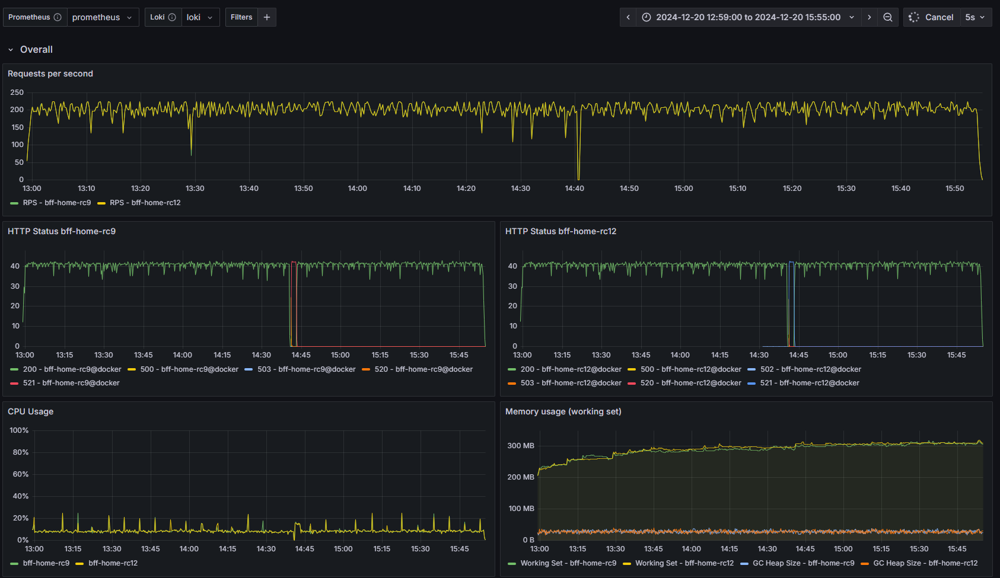

# .NET App Performance Test Suite

A comprehensive performance testing and monitoring suite for .NET applications. This repository provides containerized infrastructure to measure, compare, and analyze the performance of your .NET applications in a controlled environment using industry-standard tools like k6 for load testing, Prometheus for metrics, and Grafana for visualization.

**Key Features:**
- Side-by-side performance comparison of two app versions
- Real-time monitoring with Prometheus and Grafana
- k6-based load testing with customizable scenarios
- Integrated dotnet-monitor for memory dumps and diagnostics
- Loki log aggregation for comprehensive analysis
- Docker-based setup for reproducibility

## Prerequisites

| Requirement | Minimum Version | Notes |
|-------------|-----------------|-------|
| Docker Desktop | Latest | Required for running containerized services |
| WSL 2 | - | Install Ubuntu 20.x as the default distro (Windows only) |
| k6 | Latest | Load testing tool - [install here](https://k6.io/docs/get-started/installation/) |
| VS Code | Latest | Optional but recommended for integrated terminal |

## Quick Start

### 1. Initial Setup

#### On Windows:
Open your Windows terminal and navigate to the project:

```bash
# Clone/navigate to the repository
cd c:\workspace\dotnet-perf-test-suite

# Open in VS Code from Windows terminal
code .
```

#### On Linux/Mac:
```bash
cd /path/to/dotnet-perf-test-suite
code .
```

### 2. Configure Environment Variables

From the VS Code integrated terminal (terminal will run in WSL context on Windows):

```bash
# Copy the example environment file
cp .env.example .env

# Edit .env with your application paths
code .env
```

Update these paths in your `.env` file to match your setup:

```bash
# Example configuration
PROJECT_DIR_ABS_PATH=/mnt/c/workspace/dotnet-perf-test-suite
APP1_SOLUTION_FOLDER_ABS_PATH=/mnt/c/workspace/app/dotnet-app1
APP1_BIN_FOLDER_ABS_PATH=/mnt/c/workspace/app/dotnet-app1/dotnetapp/bin/debug/net8.0/
APP1_DLL_ENTRYPOINT=dotnetapp.dll
```

> **Note:** On Windows with WSL, use `/mnt/c/` for C: drive paths. For example, `C:\Users\...` becomes `/mnt/c/Users/...`

### 3. Start the Services

In the VS Code integrated terminal:

```bash
docker compose up -d
```

This starts all containerized services including Prometheus, Grafana, Loki, and your application containers.

## Running Load Tests

### Add Domain Mappings

Add these entries to your hosts file so k6 can reach your applications:

**Windows (`C:\Windows\System32\drivers\etc\hosts`):**
```
127.0.0.1 app1.localhost
127.0.0.1 app2.localhost
```

**Linux/Mac (`/etc/hosts`):**
```
127.0.0.1 app1.localhost
127.0.0.1 app2.localhost
```

### Run a Load Test

From your **Windows terminal** (not WSL):

```bash
k6 run load-test-example.js
```

The provided `load-test-example.js` is a baseline example that:
- Simulates concurrent users
- Creates individual guest tokens stored in Redis
- Makes API requests to both app1 and app2
- Automatically regenerates tokens as needed

See the comments in `load-test-example.js` to customize for your specific test scenarios.

## Monitoring Performance

### Access Grafana Dashboard

1. Open your browser and go to: `http://localhost:3000/login`
2. Login with default credentials:
   - Username: `admin`
   - Password: `admin`

### Configure Data Sources

Once logged in, configure two data sources:

**Prometheus:**
1. Click "Add your first data source"
2. Select "Prometheus"
3. Set URL to: `http://host.docker.internal:30090`
4. Click "Save & test" (should succeed)

**Loki:**
1. Click "Add your first data source"
2. Select "Loki"
3. Set URL to: `http://host.docker.internal:3101`
4. Click "Save & test" (should succeed)

### Import Dashboard Templates

1. Go to Dashboards → Import
2. Select a dashboard JSON file from `./apps/grafana-dashboard/`
   - `default-dashboard.json` - Single app monitoring
   - `side-by-side-comparison.json` - Compare two apps

**Example dashboard view:**



## Comparing Two Apps in Parallel

To run performance comparisons between two versions of your application:

### 1. Update Environment File

Edit your `.env` file to configure both app paths:

```bash
# App 1 configuration
APP1_SOLUTION_FOLDER_ABS_PATH=/mnt/c/workspace/app/dotnet-app1
APP1_BIN_FOLDER_ABS_PATH=/mnt/c/workspace/app/dotnet-app1/dotnetapp/bin/debug/net8.0/

# App 2 configuration
APP2_SOLUTION_FOLDER_ABS_PATH=/mnt/c/workspace/app/dotnet-app2
APP2_BIN_FOLDER_ABS_PATH=/mnt/c/workspace/app/dotnet-app2/dotnetapp/bin/debug/net8.0/
```

### 2. Start Containers with Override

```bash
docker compose -f docker-compose.yml -f docker-compose.app2.override.yml up -d
```

Now run your load tests and compare the metrics in Grafana using the side-by-side comparison dashboard.

## Updating Application Code

The `.env` file specifies your app's bin folder path. Since this folder is mounted into the Docker containers:

1. Rebuild your application in Visual Studio or via dotnet CLI
2. The new DLLs will immediately reflect in the containers
3. Restart containers only if needed: `docker compose restart app1 app2`

## Generating Memory Dumps

Memory dumps are useful for analyzing memory leaks and performance issues. Two tools are available:

### Option 1: Using dotnet-monitor

Access the endpoints directly in your browser or via curl:

**App 1 - Full Memory Dump:**
```
http://localhost:52323/dump?pid=1&type=Full
```

**App 2 - Full Memory Dump:**
```
http://localhost:52327/dump?pid=1&type=Full
```

**Via curl:**
```bash
curl http://localhost:52323/dump?pid=1&type=Full -o app1-dump.dmp
curl http://localhost:52327/dump?pid=1&type=Full -o app2-dump.dmp
```

### Option 2: Using JetBrains dotMemory

1. Open a terminal inside the running app container:
   ```bash
   docker exec -it app1 bash
   ```

2. Execute the memory snapshot script:
   ```bash
   /tools/dotmemory-getsnapshot.sh
   ```

3. The dump will be saved to `/data/app1` (or `/data/app2` for app2)

## Common Paths Reference

| Purpose | Windows Path | WSL Path | Docker Path |
|---------|--------------|----------|------------|
| Project root | `C:\workspace\dotnet-perf-test-suite` | `/mnt/c/workspace/dotnet-perf-test-suite` | `/app` |
| Grafana data | `./data/grafana` | `/data/grafana` | `/var/lib/grafana` |
| Prometheus data | `./data/prometheus` | `/data/prometheus` | `/prometheus` |
| App 1 data | `./data/app1` | `/data/app1` | `/docker-data` |
| App 2 data | `./data/app2` | `/data/app2` | `/docker-data` |

## Useful Docker Commands

```bash
# View all running containers
docker compose ps

# View logs for a specific service
docker compose logs -f app1

# Stop all services
docker compose down

# Stop all services and remove volumes
docker compose down -v

# Restart a specific container
docker compose restart app1
```